# Connect Raspberry Pi to Laptop Wirelessly

**This tutorial covers how to connect Raspberry Pi to Laptop wirelessly. Share your Raspberry Pi screen on laptop screen and control it with laptop mouse and keyboard.**

**We will soon make a YouTube Tutorial which will be posted [here.](https://www.youtube.com/c/samvidita)**

## Table of content

1. [Install Raspberry Pi Imager and download OS](https://github.com/samvidita/Connect-RaspberryPi-to-laptop-wirelessly#step1--install-raspberry-pi-imager-and-download-os)
2. [Flash OS to microSD card](https://github.com/samvidita/Connect-RaspberryPi-to-laptop-wirelessly#step2--flash-os-to-microsd-card)
3. [Enable SSH and configure WiFi](https://github.com/samvidita/Connect-RaspberryPi-to-laptop-wirelessly#step3--enable-ssh-and-configure-wifi)
4. [Enable VNC and Configure Raspberry Pi](https://github.com/samvidita/Connect-RaspberryPi-to-laptop-wirelessly#step4--enable-vnc-and-configure-raspberry-pi)
5. [Share Raspberry Pi screen with VNC viewer](https://github.com/samvidita/Connect-RaspberryPi-to-laptop-wirelessly#step5--share-raspberry-pi-screen-with-vnc-viewer)
6. [Appendix](https://github.com/samvidita/Connect-RaspberryPi-to-laptop-wirelessly#appendix)
7. [Quick links](https://github.com/samvidita/Connect-RaspberryPi-to-laptop-wirelessly#quick-links)

## Step1 : Install Raspberry Pi Imager and download OS

Raspberry Pi Imager is the quick and easy way to install Raspberry Pi OS and other operating systems to a microSD card. Download and install [Raspberry Pi Imager](https://www.raspberrypi.org/software/) for your operating system.

Many operating systems are available for Raspberry Pi, including Raspberry Pi OS. `Raspberry PI OS Lite` is a minimal operating system. This image contains only the core operating system and boots to a command line instead of a GUI or desktop environment. `Raspberry Pi OS with desktop` comes with desktop GUI. Download the [Raspberry Pi OS](https://www.raspberrypi.org/software/operating-systems/) of your choice.

> _Note : `Debian with Raspberry Pi Desktop` is the operating system for PC and Mac. Download the Raspberry Pi OS instead._

## Step2 : Flash OS to microSD card

Open Raspberry Pi Imager and insert microSd card to laptop with card reader. At first we need to format the microSD card.

> _Note : Class 10 microSd card with minimum 8GB of space is recommended._

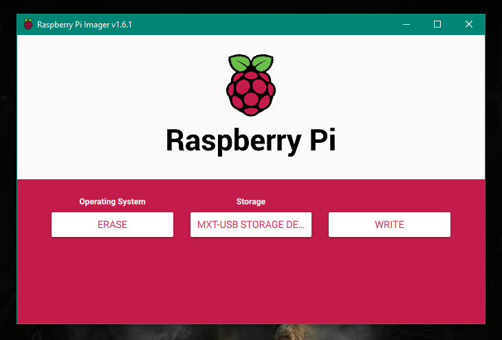

Select operating system as ERASE, then select the storage space and click on write. This will format the microSD card.

After formatting microSD card next step is to flash OS to microSD card. We can select any OS in Raspberry Pi Imager. This will download the OS and then flash it to microSD card. Since we have already downloaded the OS we need to select custom and then select OS image from local downloaded folder. Usually OS image will be downloaded in _.img .zip .iso .gz .xz_ format.

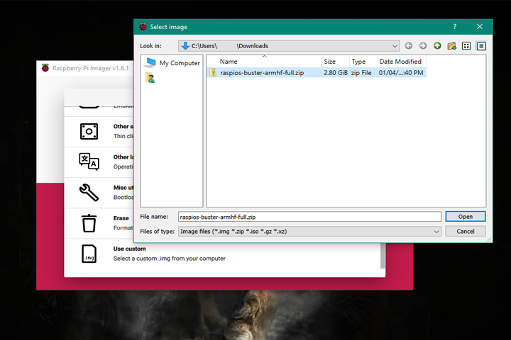

Then select storage device and click on write. This will flash OS to microSD card. It will take some time.

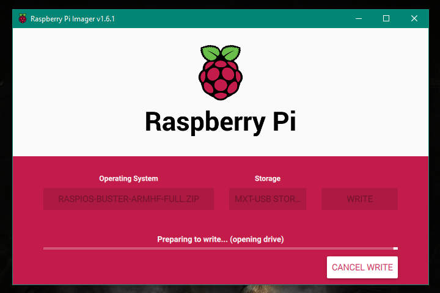

## Step3 : Enable SSH and configure WiFi

Using [SSH](https://www.raspberrypi.org/documentation/remote-access/ssh/) we can access the command line of a Raspberry Pi remotely from another computer or device on the same network. To enable SSH in Raspberry Pi we need to add a blank file named `ssh` in boot partition without any extension. This will enable SSH during boot time and delete the ssh file created. To create `ssh` file in a simple way we just need to open command prompt and type the following command. It will create `ssh` file

    echo>boot_partition_name:\ssh

> _Note : Repalce boot_partition_name with your partition name e.g. echo>I:\ssh_

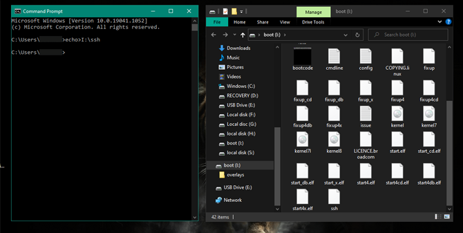

After enabling SSH, [Cofigure Wifi.](https://www.raspberrypi.org/documentation/configuration/wireless/headless.md) We need to add the details of the wireless network to which we want to connect our Raspberry Pi. Basically we need to create `wpa_supplicant.conf` file and palce it in a boot partion. During boot Raspberry Pi will connect to the wireless network of which details are given. Open any text editor and add following lines

    ctrl_interface=DIR=/var/run/wpa_supplicant GROUP=netdev
    update_config=1
    country=<Country code>

    network={
        ssid="<Name of your wireless LAN>"
        psk="<Password for your wireless LAN>"
        scan_ssid=1
    }

> _Note : The Raspberry Pi and the laptop to which you want connect your Pi need to be connected to same wireless network_

Add the details like SSID, Password (In case of open network leave password field balnk with double quotes) and Country your code. You can find country codes [here](https://www.arubanetworks.com/techdocs/InstantWenger_Mobile/Advanced/Content/Instant%20User%20Guide%20-%20volumes/Country_Codes_List.htm). If your WiFi network is not hidden then remove `scan_ssid=1`

## Step4 : Enable VNC and Configure Raspberry Pi

[VNC](https://www.raspberrypi.org/documentation/remote-access/vnc/) is a graphical desktop sharing system that allows you to remotely control the desktop interface of one computer (running VNC Server) from another computer. [VNC Viewer](https://www.realvnc.com/en/connect/download/viewer/) transmits the keyboard and either mouse or touch events to VNC Server, and receives updates to the screen in return. You will see the desktop of the Raspberry Pi inside a window on your computer or mobile device. You'll be able to control it as though you were working on the Raspberry Pi itself.

To enable VNC we need to download an [SSH client](https://www.raspberrypi.org/documentation/remote-access/ssh/windows.md). The most commonly used client is called PuTTY and can be downloaded from [here](https://www.chiark.greenend.org.uk/~sgtatham/putty/latest.html). Install and open PuTTY, set the connection type as SSH, port as 22 and type the following host name.

    raspberrypi.local

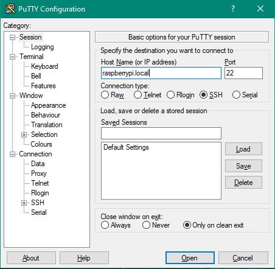

Click on open. If WiFi configuarion is not correct, you eventually see a message saying `Network error: Connection timed out`. When the connection works you will see the security warning. You can safely ignore it, and click the 'Yes' button. You will now see the usual login prompt. The default username for Raspberry Pi OS is `Pi` and password is `raspberry`. You should now have the Raspberry Pi prompt.

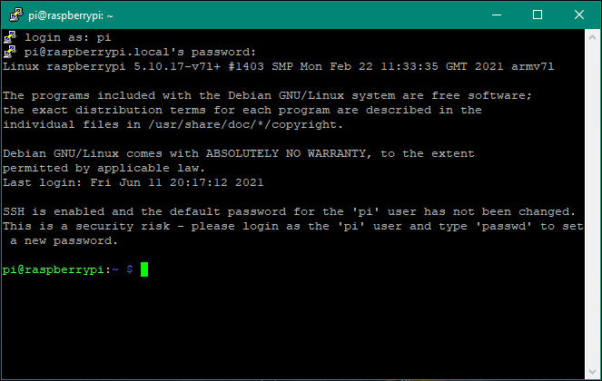

Now we need to [configure Raspberry Pi.](https://www.raspberrypi.org/documentation/configuration/raspi-config.md) Type the following command in Raspberry Pi command prompt and press enter.

    sudo raspi-config

This command will open Raspberry Pi configuration window as shown below.

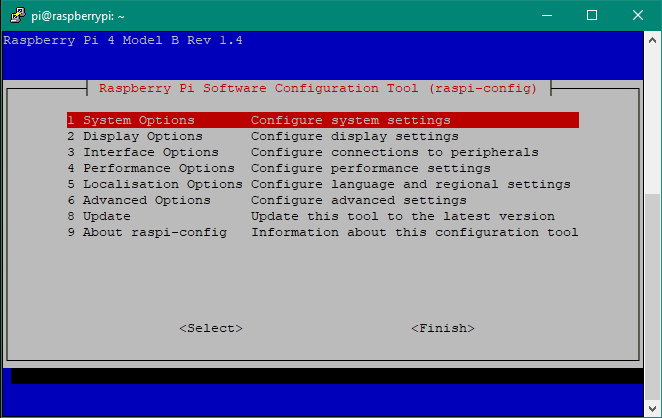

Go to `Interface Options` and select `VNC`, and press enter to enable it.

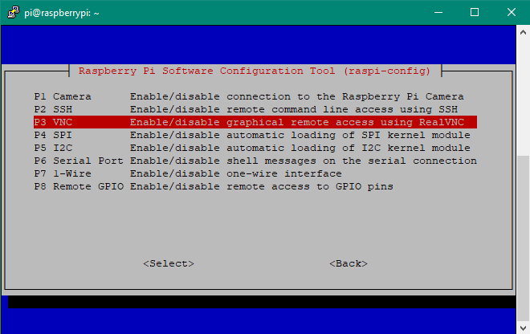

Next in the Raspberry Pi configuration main menu go to `System options` from there select `Boot / AUto login` and finally select `Desktop Autologin`. This will automatically login as 'Pi' user desktop GUI.

Here we are done with [Raspberry Pi configuration](https://www.raspberrypi.org/documentation/configuration/raspi-config.md) and enabled [VNC](https://www.raspberrypi.org/documentation/remote-access/vnc/). Click on finish and reboot your Pi.

## Step5 : Share Raspberry Pi screen with VNC viewer

VNC viewer a graphical desktop sharing system that allows a user to remotely control the desktop of a remote computer (running VNC Server) from your device, and it transmits the keyboard and mouse or touch events to VNC Server, so that once you are connected, you have control over the computer you’ve accessed. You can download VNC viewer from [here](https://www.realvnc.com/en/connect/download/viewer/).

Open VNC viewer and type `raspberrypi.local` as server adreess. If Raspberry Pi and laptop are connected to same network, then authentication window will pop up. Enter the Pi credentials.
Default username `Pi` and password is `raspberry`.

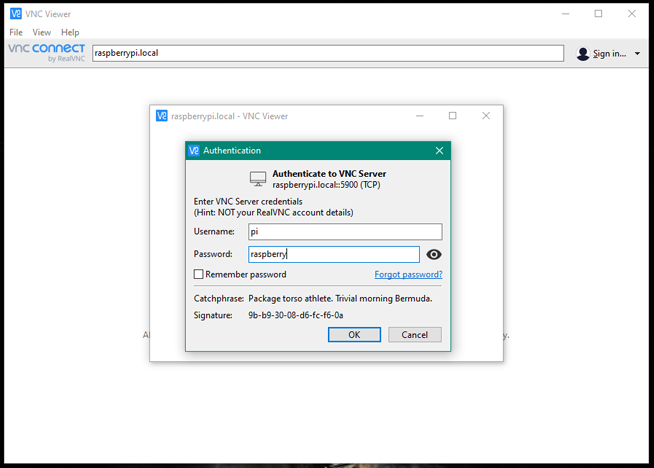

After successful login you can see Raspberry Pi desktop interface on your laptop screen. You can control the Raspberry Pi with laptop mouse and keyboard.

## Appendix

### VNC Viewer 'Cannot currently show the desktop' error

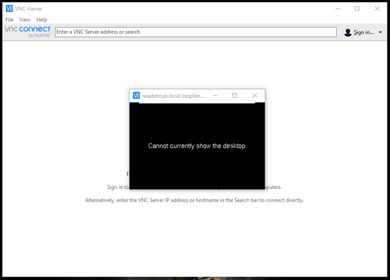

Some time we will face this issue while connecting with VNC Viewer. This is because of the resolution we set in the Raspberry Pi configuration. To solve this issue follow the below steps.

Open SSH client (PuTTY in our case), connect to Raspberry Pi and login with the credentials. Then Go to Raspberry Pi configuration window by typing `sudo raspi-config` in command line. (These steps are mentioned above). In the configuration menu select `dispaly settings`

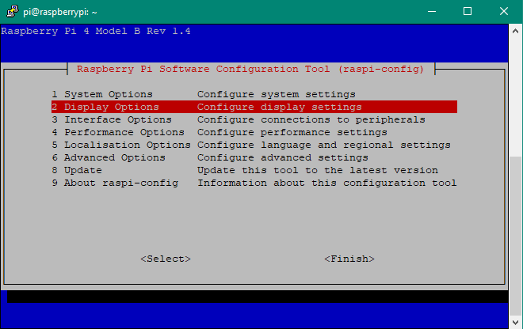

Then select resolution and change the resolution from `default` to any other resolution.

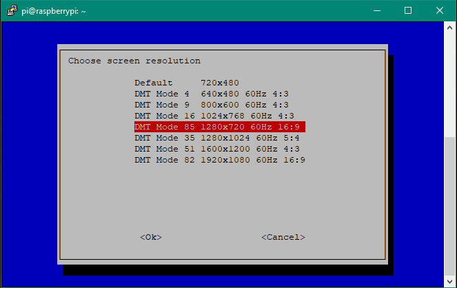

Now if we connect again with VNC viewer screen will be visible. Here we are done with connecting our Raspberry Pi with Laptop.

## Quick Links

- Raspberry Pi - https://www.raspberrypi.org
- PuTTY - https://www.chiark.greenend.org.uk/~sgtatham/putty/latest.html
- VNC Viewer - https://www.realvnc.com/en/connect/download/viewer/
